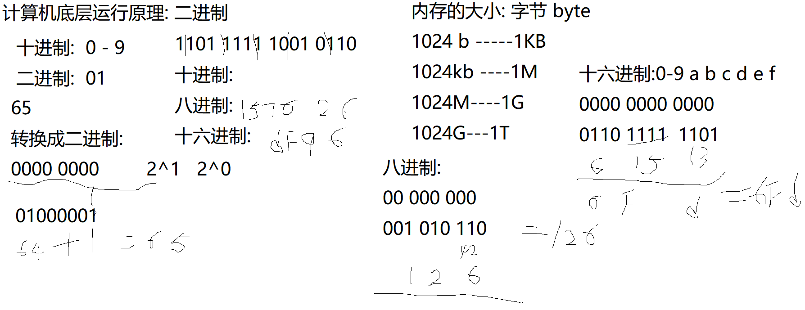
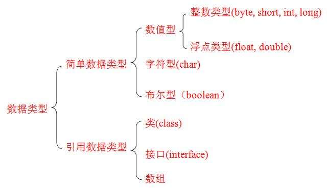
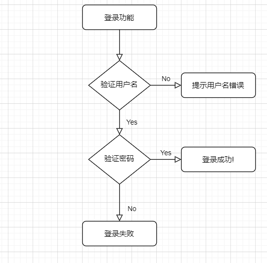
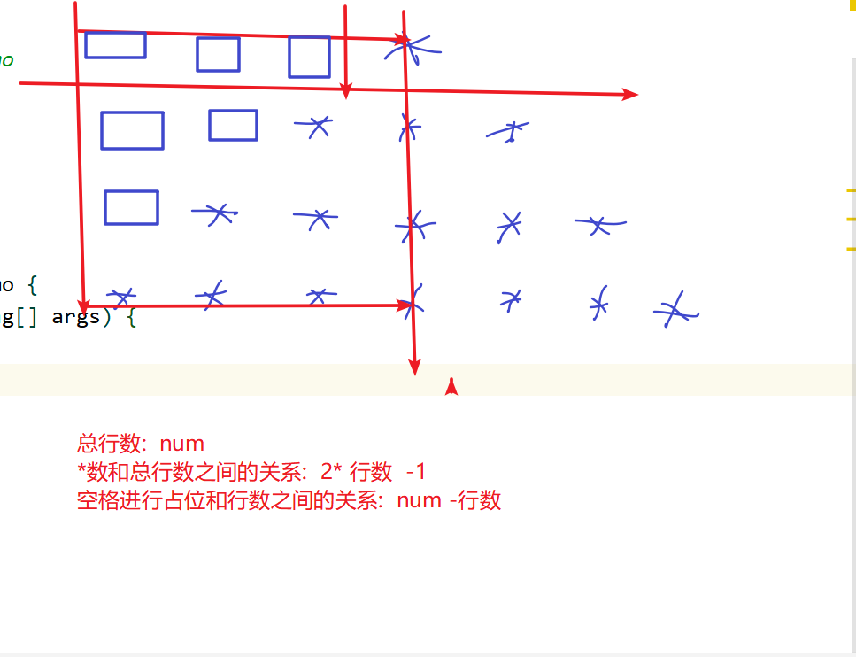
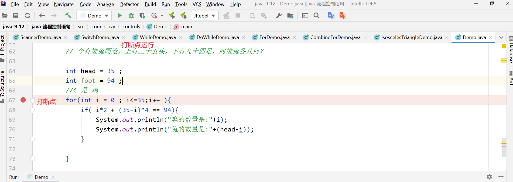
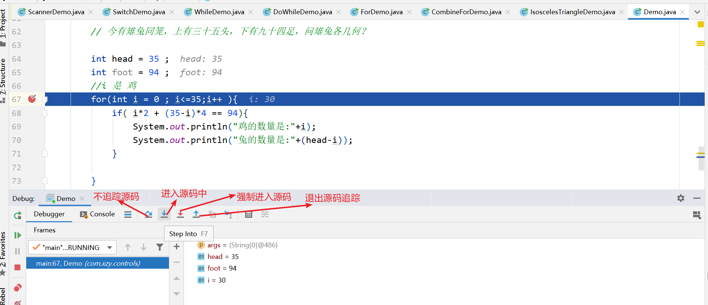
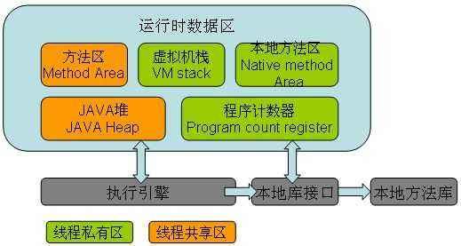
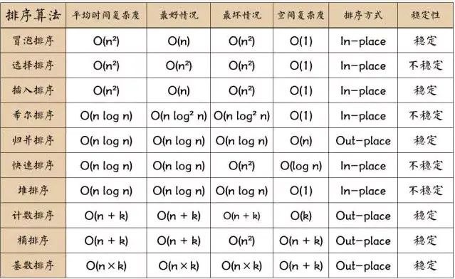
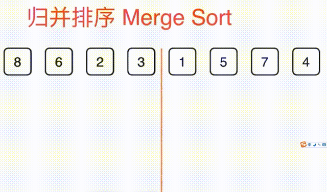

# Java基础语法

> Java是一门编程语言,所以有自己特定的语法。
>
> 编写 Java 程序时，应注意以下几点：
>
> - **大小写敏感**：Java 是大小写敏感的，这就意味着标识符 Hello 与 hello 是不同的。
> - **类名**：对于所有的类来说，类名的首字母应该大写。如果类名由若干单词组成，那么每个单词的首字母应该大写，例如 **MyFirstJavaClass** 
> - **方法名**：所有的方法名都应该以小写字母开头。如果方法名含有若干单词，则后面的每个单词首字母大写。
> - **源文件名**：源文件名必须和类名相同。当保存文件的时候，你应该使用类名作为文件名保存（切记 Java 是大小写敏感的），文件名的后缀为 **.java**。（如果文件名和类名不相同则会导致编译错误）。
> - **主方法入口**：所有的 Java 程序由 **public static void main(String[] args)** 方法开始执行。

## 1. 关键字和保留关键字

> **关键字概述**
> 	被Java语言赋予特定含义的单词
>
> **关键字特点**
>  	组成关键字的字母全部小写
>
> **关键字注意事项**
> 	*goto和const*作为保留字存在,目前并不使用
> 	类似Notepad++这样的高级记事本,针对关键字有特殊的颜色标记，非常直观

| 用于定义数据类型的关键字   |           |        |       |          |
| -------------------------- | --------- | ------ | ----- | -------- |
| class                      | interface | byte   | short | int      |
| long                       | float     | double | char  | boolean  |
| void                       |           |        |       |          |
| 用于定义数据类型值的关键字 |           |        |       |          |
| true                       | false     | null   |       |          |
| 用于定义流程控制的关键字   |           |        |       |          |
| if                         | else      | switch | case  | default  |
| while                      | do        | for    | break | continue |
| return                     |           |        |       |          |

| 用于定义访问权限修饰符的关键字               |            |           |              |        |
| -------------------------------------------- | ---------- | --------- | ------------ | ------ |
| private                                      | protected  | public    |              |        |
| 用于定义类，函数，变量修饰符的关键字         |            |           |              |        |
| abstract                                     | final      | static    | synchronized |        |
| 用于定义类与类之间关系的关键字               |            |           |              |        |
| extends                                      | implements |           |              |        |
| 用于定义建立实例及引用实例，判断实例的关键字 |            |           |              |        |
| new                                          | this       | super     | instanceof   |        |
| 用于异常处理的关键字                         |            |           |              |        |
| try                                          | catch      | finally   | throw        | throws |
| 用于包的关键字                               |            |           |              |        |
| package                                      | import     |           |              |        |
| 其他修饰符关键字                             |            |           |              |        |
| native                                       | strictfp   | transient | volatile     | assert |

## 2. 标识符

> Java 所有的组成部分都需要名字。类名、变量名以及方法名都被称为标识符。
>
> 关于 Java 标识符，有以下几点需要注意：
>
> - 所有的标识符都应该以字母（A-Z 或者 a-z）,美元符（$）、或者下划线（_）开始
> - 首字符之后可以是字母（A-Z 或者 a-z）,美元符（$）、下划线（_）或数字的任何字符组合
> - 关键字不能用作标识符
> - 标识符是大小写敏感的
> - 合法标识符举例：age、$salary、_value、__1_value
> - 非法标识符举例：123abc、-salary

在实际开发中我们推荐大家严格遵守阿里巴巴java开发手册(嵩山版),严格规范自己的代码开发习和规范。

[阿里巴巴JAVA开发手册嵩山版 GitHub](https://github.com/alibaba/p3c/blob/master/Java%E5%BC%80%E5%8F%91%E6%89%8B%E5%86%8C%EF%BC%88%E5%B5%A9%E5%B1%B1%E7%89%88%EF%BC%89.pdf)

[阿里云java开发在线手册](https://developer.aliyun.com/special/tech-java)

> :exclamation:开发过程中注意:
>
> 1. 起名不能太随意，实际开发中禁止使用中文进行命名。实在不行也可以使用拼音，具体查询阿里巴巴开发手册
> 2. 在公司开发，遵守公司项目开发文档规范，严格遵守公司的约定和规范。
> 3. 多使用英文工具，谷歌翻译，有道词典等，常用开发的单词需要熟记。

> 驼峰命名法:
>
> 1. 大驼峰命名法:
> 2. 小驼峰命名法:

## 3. 注释

> **注释: 用于解释说明程序的文字**
>
> java中的注释分为三类:
>
> 1. 单行注释  //
> 2. 多行注释 /\*注释的内容\*/
> 3. 文档注释  /\*\* 注释的内容\*/
>
> **单行注释和多行注释在多个语言中是通用的,在java中单行注释和多行注释不会被编译进.class文件中，文档注释是java独有的，我们在后边可以使用javadoc.exe 根据我们在代码中的各种注释，帮助我们生成类似JAVAAPI一样的代码帮助文档，方便我们查阅代码中的类，以及方法的作用。**

```java

```

>:grey_exclamation:**注释的作用**:
>
>1. 作为程序员一定要养成给代码添加注释的良好的习惯。
>2. 有详细的注释的代码不仅是方便自己阅读，也是方便他人阅读，也是为后续的开发者提供方便。方便代码排错。
>3. 在写代码之前先去添加注释，整理代码的思路，再用代码体现出来。
>4. 代码也仅仅是思想的体现，

## 4. 常量

> **常量: 在程序执行的过程中其值不可以发生改变**
>
> 在java中常量分为两种:
>
> 1. 字面值常量
> 2. 自定义常量(面向对象部分详解)

### 4.1 字面值常量

1. 字符串常量
2. 整数值常量
3. 小数常量
4. 字符常量
5. 布尔值常量
6. 空常量   (null)

```java
String str = "Hello World";
		char ch = 'a';
		float price = 99.999f;
		Object obj = null;
```

```java
/**
	*  java中针对整数常量提供了四种表现形式:
	*  1. 二进制  以0b开头
	*  2. 十进制  整数默认就是十进制
	*  3. 八进制  以0开头
	*  4. 十六进制   以0x开头
	*
	*/
	public static void  method() {
		//0000 1111
		int sum = 0b101;
		int price = 10000;
		int num = 0111; // 8^2+8^1+8^0
		int total = 0x0aef;
		System.out.println("sum="+sum);
		System.out.println("num="+num);
		System.out.println("total="+total);
	}
//执行结果
sum=5
num=73
total=2799
```

## 5. 进制和进制转换

> 1. 二进制
>
> 2. 十进制
> 3. 8进制
> 4. 十六进制



## 6. 变量

> 1. 从本质上讲，变量其实是内存中的一小块区域，使用变量名来访问这块区域，因此，每一个变量使用前必须要先申请（声明），然后必须进行赋值（填充内容），在通过变量的名称引用到这块区域中保存的值才能使用。
>    	数据类型  变量名 = 变量值
>    
> 2. 为什么要定义变量呢
>
>     用来不断的存放同一类型的常量，并可以重复使用
>
> 3. 变量一定要先初始化才能使用

```java
/** 变量:
*       计算机的内存:
 *          物理内存: 持久性的数据
 *          运行内存: 临时的数据
*   本质: 就是在内存中开辟一段空间，在这个空间中放入一个数值，在使用一个变量名去引用到这段空间中的值。
 *   变量的声明:
 *      数据类型  变量名称  = 变量的值;
 *      int  num = 200;
 *    注意:java是强数据类型语言
 *    声明的数据类型 必须和赋值值的数据类型一致。
 *    变量的值是否变化:
 *      值可以变化的:
 *      值不可以变化的(常量):
 *    值没有变化的变量:
 *      数字类型:
 *      浮点类型:
 *      字符串:
 *   整数常量:
 *   1. 十进制
 *   2. 二进制   0b开头
 *   3. 八进制  以0开头
 *   4. 十六进制  以0x开头
* */
public class FinalVariable {

    public static void main(String[] args) {
        int num = 200;
        //变量重新赋值
            num = 300;
        int num1 = 200;
        System.out.println(num + num1);//500
        //整数常量:
        //二进制常量
        int sum = 0b111;
        //八进制
        int  age = 0101;
        //十六进制
        int total = 0xabc;

        System.out.println(sum);
        System.out.println(age);
        System.out.println(total);
    }

}
```

## 7. 数据类型

> **Java语言是强类型语言，对于每一种数据都定义了明确的具体数据类型，在内存总分配了不同大小的内存空间**
>
> 所谓的强数据类型就是必须先声明数据类型，在赋给变量和数据类型相同的值。
>



### 7.1 字节类型

> - byte 数据类型是8位、有符号的，以二进制补码表示的整数；
> - 最小值是 **-128（-2^7）**；
> - 最大值是 **127（2^7-1）**；
> - 默认值是 **0**；
> - byte 类型用在大型数组中节约空间，主要代替整数，因为 byte 变量占用的空间只有 int 类型的四分之一；
> - 例子：byte a = 100，byte b = -50。

### 7.2 短整型

> - short 数据类型是 16 位、有符号的以二进制补码表示的整数
> - 最小值是 **-32768（-2^15）**；
> - 最大值是 **32767（2^15 - 1）**；
> - Short 数据类型也可以像 byte 那样节省空间。一个short变量是int型变量所占空间的二分之一；
> - 默认值是 **0**；
> - 例子：short s = 1000，short r = -20000。

### 7.3 整数型

> **int：**
>
> - int 数据类型是32位、有符号的以二进制补码表示的整数；
> - 最小值是 **-2,147,483,648（-2^31）**；
> - 最大值是 **2,147,483,647（2^31 - 1）**；
> - 一般地整型变量默认为 int 类型；
> - 默认值是 **0** ；
> - 例子：int a = 100000, int b = -200000。

### 7.4 长整型

>- long 数据类型是 64 位、有符号的以二进制补码表示的整数；
>- 最小值是 **-9,223,372,036,854,775,808（-2^63）**；
>- 最大值是 **9,223,372,036,854,775,807（2^63 -1）**；
>- 这种类型主要使用在需要比较大整数的系统上；
>- 默认值是 **0L**；
>- 例子： long a = 100000L，Long b = -200000L。
>  "L"理论上不分大小写，但是若写成"l"容易与数字"1"混淆，不容易分辩。所以最好大写。

### 7.5 单精度浮点类型

> - float 数据类型是单精度、32位、符合IEEE 754标准的浮点数；
> - float 在储存大型浮点数组的时候可节省内存空间；
> - 默认值是 **0.0f**；
> - 浮点数不能用来表示精确的值，如货币；
> - 例子：float f1 = 234.5f。

### 7.6 双精度浮点类型

> - double 数据类型是双精度、64 位、符合IEEE 754标准的浮点数；
> - 浮点数的默认类型为double类型；
> - double类型同样不能表示精确的值，如货币；
> - 默认值是 **0.0d**；
> - 例子：double d1 = 123.4。

### 7.7 布尔类型

> - boolean数据类型表示一位的信息；
> - 只有两个取值：true 和 false；
> - 这种类型只作为一种标志来记录 true/false 情况；
> - 默认值是 **false**；
> - 例子：boolean one = true。

### 7.8 字符类型

> - char类型是一个单一的 16 位 Unicode 字符；
> - 最小值是 **\u0000**（即为0）；
> - 最大值是 **\uffff**（即为65,535）；
> - char 数据类型可以储存任何字符；
> - 例子：char letter = 'A';。

```java
/**
 * 基本数据类型:
 *  1. byte  字节    -128---127
 *  2. short 短整数类型  -2^15---2^15-1  基本不用
 *  3. int  整数类型   -2^31----2^31-1
 *  4. long 长整型  -2^63-----2^63-1  必须以L结尾  为了区别明显一点一般使用大写
 *  5. float 单精度浮点类型   -2^32---2^31-1  以F结尾  为了区别明显一点一般使用大写
 *  6. double 双精度浮点类型  -2^31-----2^31-1  以D结尾 但是在java中浮点类型默认就是double 所以可以省略后缀不写
 *  7. boolean  布尔类型  true/false
 *  8. char  字符类型  以单引号包括的就是字符类型  一个字符类型只能有一个字母或者汉字
 * */
public class NumberType {
    public static void main(String[] args) {
        //基本数据类型
        byte  by = 127;
        short  sh = 12345;
        int num = 9999999;
        long total = 9998888888777L;
        float  price = 99.888F;
        double  totalPrice = 88.99999999d;
        boolean flag = true;
        char a = 'a';
        char name = '张';
        //引用数据类型
        //字符串类型
        String   str = "Hello World";
        
        System.out.println(by);
        System.out.println(sh);
        System.out.println(num);
        System.out.println(price);
        System.out.println(totalPrice);
        System.out.println(flag);
        System.out.println(a+0);//97
        System.out.println(name+0);//24352
        System.out.println(str);
    }
}

```

### 7.9 数据类型的默认值

| **数据类型**           | **默认值** |
| :--------------------- | :--------- |
| byte                   | 0          |
| short                  | 0          |
| int                    | 0          |
| long                   | 0L         |
| float                  | 0.0f       |
| double                 | 0.0d       |
| char                   | 'u0000'    |
| String (or any object) | null       |
| boolean                | false      |

### 7.10 转义字符

| 符号   | 字符含义                 |
| :----- | :----------------------- |
| \n     | 换行 (0x0a)              |
| \r     | 回车 (0x0d)              |
| \f     | 换页符(0x0c)             |
| \b     | 退格 (0x08)              |
| \0     | 空字符 (0x0)             |
| \s     | 空格 (0x20)              |
| \t     | 制表符                   |
| \\"    | 双引号                   |
| \\'    | 单引号                   |
| \\     | 反斜杠                   |
| \ddd   | 八进制字符 (ddd)         |
| \uxxxx | 16进制Unicode字符 (xxxx) |

### 7.11 数据类型转换

> 数据类型转换必须满足如下规则：
>
> 1. 不能对boolean类型进行类型转换。
>
> 2. 不能把对象类型转换成不相关类的对象。
>
> 3. 在把容量大的类型转换为容量小的类型时必须使用强制类型转换。
>
> 4.  转换过程中可能导致溢出或损失精度，例如：
>
>    int i =128;  
>
>    byte b = (byte)i;
>
> 因为 byte 类型是 8 位，最大值为127，所以当 int 强制转换为 byte 类型时，值 128 时候就会导致溢出。
>
> 5. 浮点数到整数的转换是通过舍弃小数得到，而不是四舍五入，例如：
>
>    (int)23.7 == 23;      
>
>      (int)-45.89f == -45
>    

```java
/**
 * 数据类型转换:
 * 1. 默认转换:  将小的数据类型的值 赋给大的数据类型的变量
 *
 * 2. 强制转换:
 *  a. 大的数据类型的值赋值给小的数据类型的变量，精度会丢失。
 *  b. 强转就是先将值给()转换为需要的数据类型在赋值给接收的数据类型的变量，
 *      但是如果值超出小的数据类型的范围依然会精度丢失
 * */
public class NumberTypeTransform {
    public static void main(String[] args) {
        int  num = 128;
        byte by = 122;
            // 0000 0000 0000 0000   = 0000 0000
            //num = by;
            by =  (byte) num;
        System.out.println(num);
        System.out.println(by);
        
    }
}

```

> **整型、实型（常量）、字符型数据可以混合运算。运算中，不同类型的数据先转化为同一类型，然后进行运算。**
>
> 转换从低级到高级。
>
> ```
> 低  ------------------------------------>  高
> 
> byte,short,char—> int —> long—> float —> double 
> ```


### 7.12 字符集和字符编码表

> [字符](https://baike.baidu.com/item/字符/4768913)（Character）是各种文字和符号的总称，包括各国家文字、标点符号、图形符号、数字等。字符集（Character set）是多个字符的集合，字符集种类较多，每个字符集包含的字符个数不同，常见字符集名称：ASCII字符集、GB2312字符集、BIG5字符集、 GB18030字符集、Unicode字符集等。计算机要准确的处理各种字符集文字，就需要进行[字符编码](https://baike.baidu.com/item/字符编码/8446880)，以便计算机能够识别和存储各种文字。中文文字数目大，而且还分为简体中文和[繁体中文](https://baike.baidu.com/item/繁体中文/2677789)两种不同书写规则的文字，而计算机最初是按英语单[字节](https://baike.baidu.com/item/字节/1096318)字符设计的，因此，对中文字符进行编码，是中文信息交流的技术基础。
>
> + ASCII字符集  最早的字符编码表
> + GBK  简体
> + gb2312    
> + Unicode码表
> + UTF-8
> + UTF-16
> + UTF-32

## 8. 运算符

### 8.1 算数运算符

算术运算符用在数学表达式中，它们的作用和在数学中的作用一样。下表列出了所有的算术运算符。

表格中的实例假设整数变量A的值为10，变量B的值为20：

| 操作符 | 描述                              | 例子                               |
| :----- | :-------------------------------- | :--------------------------------- |
| +      | 加法 - 相加运算符两侧的值         | A + B 等于 30                      |
| -      | 减法 - 左操作数减去右操作数       | A – B 等于 -10                     |
| *      | 乘法 - 相乘操作符两侧的值         | A * B等于200                       |
| /      | 除法 - 左操作数除以右操作数       | B / A等于2                         |
| ％     | 取余 - 左操作数除以右操作数的余数 | B%A等于0                           |
| ++     | 自增: 操作数的值增加1             | B++ 或 ++B 等于 21（区别详见下文） |
| --     | 自减: 操作数的值减少1             | B-- 或 --B 等于 19（区别详见下文） |

### 8.2 赋值运算符

| 操作符  | 描述                                                         | 例子                                     |
| :------ | :----------------------------------------------------------- | :--------------------------------------- |
| =       | 简单的赋值运算符，将右操作数的值赋给左侧操作数               | C = A + B将把A + B得到的值赋给C          |
| + =     | 加和赋值操作符，它把左操作数和右操作数相加赋值给左操作数     | C + = A等价于C = C + A                   |
| - =     | 减和赋值操作符，它把左操作数和右操作数相减赋值给左操作数     | C - = A等价于C = C - A                   |
| * =     | 乘和赋值操作符，它把左操作数和右操作数相乘赋值给左操作数     | C * = A等价于C = C * A                   |
| / =     | 除和赋值操作符，它把左操作数和右操作数相除赋值给左操作数     | C / = A，C 与 A 同类型时等价于 C = C / A |
| （％）= | 取模和赋值操作符，它把左操作数和右操作数取模后赋值给左操作数 | C％= A等价于C = C％A                     |
| << =    | 左移位赋值运算符                                             | C << = 2等价于C = C << 2                 |
| >> =    | 右移位赋值运算符                                             | C >> = 2等价于C = C >> 2                 |
| ＆=     | 按位与赋值运算符                                             | C＆= 2等价于C = C＆2                     |
| ^ =     | 按位异或赋值操作符                                           | C ^ = 2等价于C = C ^ 2                   |
| \| =    | 按位或赋值操作符                                             | C \| = 2等价于C = C \| 2                 |

### 8.3 比较运算符

下表为Java支持的关系运算符

表格中的实例整数变量A的值为10，变量B的值为20：

| 运算符 | 描述                                                         | 例子             |
| :----- | :----------------------------------------------------------- | :--------------- |
| ==     | 检查如果两个操作数的值是否相等，如果相等则条件为真。         | （A == B）为假。 |
| !=     | 检查如果两个操作数的值是否相等，如果值不相等则条件为真。     | (A != B) 为真。  |
| >      | 检查左操作数的值是否大于右操作数的值，如果是那么条件为真。   | （A> B）为假。   |
| <      | 检查左操作数的值是否小于右操作数的值，如果是那么条件为真。   | （A <B）为真。   |
| >=     | 检查左操作数的值是否大于或等于右操作数的值，如果是那么条件为真。 | （A> = B）为假。 |
| <=     | 检查左操作数的值是否小于或等于右操作数的值，如果是那么条件为真。 | （A <= B）为真。 |

### 8.4 逻辑运算符

下表列出了逻辑运算符的基本运算，假设布尔变量A为真，变量B为假

| 操作符 | 描述                                                         | 例子                |
| :----- | :----------------------------------------------------------- | :------------------ |
| &&     | 称为逻辑与运算符。当且仅当两个操作数都为真，条件才为真。     | （A && B）为假。    |
| \| \|  | 称为逻辑或操作符。如果任何两个操作数任何一个为真，条件为真。 | （A \| \| B）为真。 |
| ！     | 称为逻辑非运算符。用来反转操作数的逻辑状态。如果条件为true，则逻辑非运算符将得到false。 | ！（A && B）为真。  |

### 8.5 位运算符

下表列出了位运算符的基本运算，假设整数变量 A 的值为 60 和变量 B 的值为 13：

| 操作符 | 描述                                                         | 例子                           |
| :----- | :----------------------------------------------------------- | :----------------------------- |
| ＆     | 如果相对应位都是1，则结果为1，否则为0                        | （A＆B），得到12，即0000 1100  |
| \|     | 如果相对应位都是 0，则结果为 0，否则为 1                     | （A \| B）得到61，即 0011 1101 |
| ^      | 如果相对应位值相同，则结果为0，否则为1                       | （A ^ B）得到49，即 0011 0001  |
| 〜     | 按位取反运算符翻转操作数的每一位，即0变成1，1变成0。         | （〜A）得到-61，即1100 0011    |
| <<     | 按位左移运算符。左操作数按位左移右操作数指定的位数。         | A << 2得到240，即 1111 0000    |
| >>     | 按位右移运算符。左操作数按位右移右操作数指定的位数。         | A >> 2得到15即 1111            |
| >>>    | 按位右移补零操作符。左操作数的值按右操作数指定的位数右移，移动得到的空位以零填充。 | A>>>2得到15即0000 1111         |

### 8.6 三元运算符

条件运算符也被称为三元运算符。该运算符有3个操作数，并且需要判断布尔表达式的值。该运算符的主要是决定哪个值应该赋值给变量。

```
variable x = (expression) ? value if true : value if false
```

### 8.7 Java运算符的优先级

下表中具有最高优先级的运算符在的表的最上面，最低优先级的在表的底部。

| 类别     | 操作符                                     | 关联性   |
| :------- | :----------------------------------------- | :------- |
| 后缀     | () [] . (点操作符)                         | 左到右   |
| 一元     | expr++ expr--                              | 从左到右 |
| 一元     | ++expr --expr + - ～ ！                    | 从右到左 |
| 乘性     | * /％                                      | 左到右   |
| 加性     | + -                                        | 左到右   |
| 移位     | >> >>>  <<                                 | 左到右   |
| 关系     | > >= < <=                                  | 左到右   |
| 相等     | == !=                                      | 左到右   |
| 按位与   | ＆                                         | 左到右   |
| 按位异或 | ^                                          | 左到右   |
| 按位或   | \|                                         | 左到右   |
| 逻辑与   | &&                                         | 左到右   |
| 逻辑或   | \| \|                                      | 左到右   |
| 条件     | ？：                                       | 从右到左 |
| 赋值     | = + = - = * = / =％= >> = << =＆= ^ = \| = | 从右到左 |
| 逗号     | ，                                         | 左到右   |

```java
/** 运算符: 我们在程序中要进行 加减乘除...的运算，使用到的连接符
 *  1· 算数运算符
 *      +
 *      -
 *      *
 *      /
 *      % 取模  相除求余数 小的数取模于大的数结果仍是小的数
 *      ++ 在原来的基数上自增加1
 *          前++ 先运算再赋值  先在原来的基数上加1 然后将新的值赋值给这个基数变量在使用。
 *          后++ 先赋值再运算  先在原来的基数上赋值给原来的数值，在下次使用基数变量的时候在进行加1以后的运算。
 *      --在原来的基数上自增减1
 *
 *  2. 赋值运算符
 *      =
 *      += -= *= /= %=
 *
 *  3. 比较运算符(关系运算符) 结果是boolean值
 *      > < >=  <=  !=
 *      ==  在基本数据类型中我们比较的是值是否相等
 *          在引用数据类型中我们比较的是地址值是否相等(面向对象中说)
 *  4. 逻辑运算符  逻辑运算符左右两侧都是布尔表达式 (布尔表达式运算结果是true 或者 false)
 *      &&  与  左右两侧都成立 结果成立
 *      || 或  左右两个一个成立结果成立  中断开关 前面成立就不用看后边的结果了
 *      ! 非  取反  去相反的结果值
 *  5. 位运算符  所有的位运算符都是基于二进制  位运算式最快的
 *    &  相对位是1结果是1 否则为 0
 *    |  相对位是0 结果是0 否则 为1
 *    ^  相对位值相同结果是0  否则为1
 *    >>  左移
 *    << 右移
 *  6. 三元运算符(三目运算符)  布尔表达式成立执行冒号前面的不成立执行冒号后边的
 *     布尔表达式 ? "成立":"不成立";
 *  表达式: 使用运算符连接起来的 就是表达式
*
* */
public class ArithmeticOperator {
    public static void main(String[] args) {
        System.out.println("------算数运算符--------");
        //算数运算符
        int num = 999;
        int num1 = 300;
        System.out.println(num + num1);//1299
        System.out.println(num - num1);//699
        System.out.println(num * num1);//299700
        System.out.println(num / num1);//3
        System.out.println(num % num1);//99
        System.out.println(300 % 999);//300

        System.out.println(++num1);//301

        System.out.println(num++);//999
        System.out.println(num);//1000

        int price = 888;
        System.out.println(--price);//887
        System.out.println(price ++);//887
        System.out.println(price);//888

        System.out.println("----------赋值运算符--------");
         String  name = "joke";
         int sum = 666;
         //先给原来的变量+20 在将结果赋值给原来的变量
         //sum = sum + 20;
         sum += 20; //上面的简写形式
        System.out.println("-------比较运算符----------");
        System.out.println(100 > 20);//true
        System.out.println(100 >  200);//false
        System.out.println(100 != 300);//true
        System.out.println(100 == 300);//false

        System.out.println("--------逻辑运算符---------");

        System.out.println(100 > 20 && 200 > 100);//true
        System.out.println(100 > 20 && 200 < 100);//false

        System.out.println(100 > 20 || 200 < 100);//true
        System.out.println(100 < 20 || 200 > 100);//true

        System.out.println(!(100 > 20 ));//false


        System.out.println("---------位运算符-----------");
        System.out.println(8 & 6);//1000  0110    ====>  0
        System.out.println(13 | 10);// 1101  1010 =====> 1111
        System.out.println(13 ^ 10 );//0111
        System.out.println(2 << 3);// 0010  ===> 10000 ====>  16
        System.out.println(2 >> 2);//0

        //计算 2  的 5次方
        System.out.println(2*2*2*2*2);
        System.out.println("------------三元表达式----------");
        System.out.println(10 > 2 ? "成立":"不成立");//成立
    }
}

```

## 9.流程控制语句

+ 顺序语句  代码在执行的时候是从上到下 从左到右依次执行
+ 分支语句  
+ 循环语句

### 9.1 表达式

> 运算符连接，返回一个值

### 9.2 顺序语句

> 代码在执行的时候是从上到下 从左到右依次执行

### 9.3 分支语句

+ if语句
+ if else 语句
+ if else  if else 语句
+ switch语句



#### 9.3.1 If语句

> if(布尔表达式或者布尔值){ // 表达式或者布尔值是true 执行里面的代码。
>
> ​	执行代码:
>
> }

```java
//if 语句
        int num = 10;
        if(num > 5){
            System.out.println("10 > 5");
        }
```

#### 9.3.2 if else

> if(布尔表达式或者布尔值){// 表达式或者布尔值是true 执行里面的代码。
>
> }else{//// 表达式或者布尔值是false 执行里面的代码。
>
> }

```java
 //if else 语句
        if(10 > 100){
            System.out.println("10 > 100");
        }else {
            System.out.println("10 < 100");
        }
```

#### 9.3.3  if else if else 

```java
//if else if else  多层判断
        int age = 20;
        double height = 120.0;
        if(age==10){
            System.out.println("age == 10");
        }else if(height > 100){
            System.out.println("height > 100");
        }else{
            System.out.println("height < 100");
        }
```

> 阿里Java开发手册规定:
>
> if else if else 最多不要超过三层。

> 如果你的if 或者else 后边执行代码只有一行 我们就可以省略 {}，及时只有一行也不要省略。
>
> 代码结构不完整，容易出错。

#### 9.3.4 控制台输入

> 我们前面说过我们的jdk中给我们提供了java核心的jar包,rt.jar
>
> 但是java中已经帮我们写好了大概接近五千个类，供我们使用。在实际开发中我们不可能把说有的jar包引入到项目中。
>
> 核心的ja包中的类是默认引入的。(java.lang包是默认引入的),其他包中的类我们需要手动导入
>
> + import  java.util.Scanner;  import   包名.类名;
> + import  java.util.\*;   引入包中所有的类;

```java
/**导入Scanner的包    导包*/

import java.util.Scanner;

/**
 * ClassName ScannerDemo
 * Description:控制台输入
 *
 * @Author:一尘
 * @Version:1.0
 * @Date:2020-10-21-9:34
 */
public class ScannerDemo {
    public static void main(String[] args) {
        //根据用户输入的成绩判断是哪一个等级   优 甲 乙 丙 丁
        Scanner s = new Scanner(System.in); //System.in系统标准的输入流
        // 获取控制台输入的 数据
           //String name =  s.next();//next() 接收控制台的字符串
            //String name = s.nextLine();//接收一行的数据
        int score = s.nextInt();
       // System.out.println(name);
        System.out.println(score);
        //判断成绩的大小
        if(score > 90){
            System.out.println("优");
        }else if(score > 80){
            System.out.println("甲");
        }else if(score > 60 ){
            System.out.println("乙");
        }
    }
}

```

#### 9.3.5 switch 语句

> 判断同一个变量在不同取值的时候执行不同的代码
>
> switch 默认的判断变量的数据类型只有:
>
> + int
> + char
> + byte
> + short
> + String  （JDK1.7新增的）

```java
package com.xzy.controls;

import java.util.Scanner;

/**
 * ClassName SwitchDemo
 * Description:
 *
 * @Author:一尘
 * @Version:1.0
 * @Date:2020-10-21-9:53
 */
public class SwitchDemo {
    public static void main(String[] args) {
        Scanner s = new Scanner(System.in); //alt + enter 导包
        int  score = s.nextInt();//接收控制台输入的数字类型的字符串转为int类型
        //switch 在判断的时候只能判断值相等  不能做比较
        switch(score / 10){
            case 9: //case后边只能是值  不能是关系表达式
                System.out.println("优");
                break;//终止
            case 8 :
                System.out.println("甲");
                break;
            case 6:
                System.out.println("乙");
                break;
            default: //上面的条件都不成立的时候执行
                System.out.println("丙");
                break;
        }

    }
}

```

> switch语句中的break不能省略，不然就会出现case穿透现象。

```java
 public static void main(String[] args) {
        Scanner s = new Scanner(System.in); //alt + enter 导包
        int  score = s.nextInt();//接收控制台输入的数字类型的字符串转为int类型
        //switch 在判断的时候只能判断值相等  不能做比较
        switch(score / 10){
            case 9: //case后边只能是值  不能是关系表达式
                System.out.println("优");
            case 8 :
                System.out.println("甲");
            case 6:
                System.out.println("乙");
            default: //上面的条件都不成立的时候执行
                System.out.println("丙");
                break;
        }

    }
```

> case穿透就是所有的语句都会执行.

### 9.4 循环语句

> 循环及时干重复的事情.
>
> java 中的循环语句:
>
> **while 循环**
>
> while(布尔表达式或者布尔值){ //布尔表达式或者布尔值是true 就执行循环体
>
> ​	循环体:
>
> }
>
> **do while循环**      无论条件是否成立  do中的代码都会执行一次
>
> do{
>
> ​	循环体:
>
> }while(布尔表达式或者布尔值)循环:
>
> **for循环**
>
> for(初始语句;循环条件;迭代体){
>
> ​		循环体;
>
> }

#### 9.4.1  while循环

> while循环中的值是true是死循环。不容易控制。
>
> 如果出现死循环。不及时停止机会出现值栈溢出。 **stackoverflow**（内存溢出）。
>
> 所以在使用while循环的时候我们要进行，在适当的时候中止循环.
>
> + 结合我们的if else 使用.  
>   + break关键字  中止循环
>   + continue 关键字  中止当前次数的循环 继续下一次循环
> + 根据循环的变量条件值控制循环次数

```java
 /* while (true){
            System.out.println("Hello while");
        }*/


    //控制 循环条件的变量值  固定循环次数
       int flag = 10;
       while(flag > 0 ){
           System.out.println("循环正常执行  "+flag);
           flag --;
       }
```

```java
 int  num = 10;
    while(true){
        System.out.println("循环正常运行 "+num);
        if(num < 0){
            //终止循环 直接退出循环最外层 循环不在执行了
            break;
        }
        num --;
    }
```

```java
int  num = 10;
while(num  > 0){
            num --;
            if(num == 5){
                // 终止当前次数的循环   继续下一次循环  直至循环结束
                continue;
            }
            System.out.println("循环正常运行 "+num);
        }
//控制台打印的结果
循环正常运行 9
循环正常运行 8
循环正常运行 7
循环正常运行 6
循环正常运行 4
循环正常运行 3
循环正常运行 2
循环正常运行 1
循环正常运行 0

Process finished with exit code 0

```

#### 9.4.2  do while循环

> ```
>  //do while循环  及时条件不成立业也会执行一次
> /* do{
>      System.out.println(" do while循环");
>  }while(false);*/
> ```

```java
 //条件成立就是死循环所以我们要控制

        int  num  = 10;
        do{
            System.out.println("循环正常执行 "+num);
            num --;
        }while(num > 0);
```

```java
int  num  = 10;
        do{
            if(num == 5){
                break;
            }
            System.out.println("循环正常执行 "+num);
            num --;
        }while(true);
//控制台输出
循环正常执行 10
循环正常执行 9
循环正常执行 8
循环正常执行 7
循环正常执行 6
```

```java
 int  num  = 10;
        do{
            num --;
            if(num == 5){
                continue;
            }
            System.out.println("循环正常执行 "+num);

        }while(num > 0);
//控制台输出
循环正常执行 9
循环正常执行 8
循环正常执行 7
循环正常执行 6
循环正常执行 4
循环正常执行 3
循环正常执行 2
循环正常执行 1
循环正常执行 0
```

#### 9.4.3 for 循环

> for循环一般是在固定循环次数的循环中使用.
>
> 但是for循环也可以出现死循环.
>
> 语法结构：
>
> for(初始的变量值;循环条件;迭代体){
>
> ​	循环体;
>
> }
>
> for(int i=0;i<=10;i++){ //循环 11 次
>
> }

```java
//循环次数是根据 初始的变量值和 循环的条件 计算的出的。
        // i++ 和 ++i 在for循环中没有区别
        for(int i =0; i<=10 ; i++){
            System.out.println("循环正常执行 "+i);
        }
//控制台输出
循环正常执行 0
循环正常执行 1
循环正常执行 2
循环正常执行 3
循环正常执行 4
循环正常执行 5
循环正常执行 6
循环正常执行 7
循环正常执行 8
循环正常执行 9
循环正常执行 10

Process finished with exit code 0

```

> print和println的区别:
>
> + print 直接输出
> + pritln 换行输出

```java
 for(int i =0; i<=10 ; i++){
            System.out.print("循环正常执行 "+i);
        }
//控制台输出
循环正常执行 0循环正常执行 1循环正常执行 2循环正常执行 3循环正常执行 4循环正常执行 5循环正常执行 6循环正常执行 7循环正常执行 8循环正常执行 9循环正
```

**循环嵌套:**

> 我们可以使用循环去做很多的事情:
>
> 打印九九乘法表
>
> 输出正三角形
>
> 输出菱形
>
> 输出等腰三角形
>
> 求1000以内的水仙花数  
>
> ​	三位数   没位数的三次方之和扔等于这个数  这个数就是水仙花数  a^3+ b^3 + c^ 3=abc
>
> 求1000以内的素数  
>
> ​	只能被自己和1整除的数
>
> 求100以内的7的倍数
>
> 求100以内的偶数  奇数
>
> .......

```java
 public static void main(String[] args) {
        //九九乘法表
        //外层循环控制行
        for (int i = 1; i <=9; i++) {
            //内层循环控制列
            for(int k = 1 ; k<=9;k++){
                System.out.print(" k ");
            }
            //换行
            System.out.println();
        }
    }

//九行九列
 k  k  k  k  k  k  k  k  k 
 k  k  k  k  k  k  k  k  k 
 k  k  k  k  k  k  k  k  k 
 k  k  k  k  k  k  k  k  k 
 k  k  k  k  k  k  k  k  k 
 k  k  k  k  k  k  k  k  k 
 k  k  k  k  k  k  k  k  k 
 k  k  k  k  k  k  k  k  k 
 k  k  k  k  k  k  k  k  k 
```
**九九乘法表:**

```java
 //效果出来了
       /* for (int i = 1; i <=9; i++) {
            //内层循环控制列
            for(int k = 1 ; k<=9;k++){
                System.out.print(k + "*"+ i +"="+ k*i +  "\t");
            }
            //换行
            System.out.println();
        }*/
        //我们看道的是一个直角三角形   在进行代码的优化
        for (int i = 1; i <=9; i++) {
            //内层循环控制列
            for(int k = 1 ; k<= i;k++){
                System.out.print(k + "*"+ i +"="+ k*i +  "\t");
            }
            //换行
            System.out.println();
        }
//打印的效果
1*1=1	
1*2=2	2*2=4	
1*3=3	2*3=6	3*3=9	
1*4=4	2*4=8	3*4=12	4*4=16	
1*5=5	2*5=10	3*5=15	4*5=20	5*5=25	
1*6=6	2*6=12	3*6=18	4*6=24	5*6=30	6*6=36	
1*7=7	2*7=14	3*7=21	4*7=28	5*7=35	6*7=42	7*7=49	
1*8=8	2*8=16	3*8=24	4*8=32	5*8=40	6*8=48	7*8=56	8*8=64	
1*9=9	2*9=18	3*9=27	4*9=36	5*9=45	6*9=54	7*9=63	8*9=72	9*9=81
```

**打印等腰三角形:**



```java
 public static void main(String[] args) {
        //等腰三角形
        //行数
        int  num = 6;
        for(int i = 1;i<=num;i++){
            //打印空格占位
            //前半边占位的空格和行数的关系 是总的行数 -1
            for(int k = num -i; k >= 0 ;k--){
                System.out.print(" ");
            }
            //打印行后半边的*
            for(int j = 1;j<=2*i -1;j++){
                System.out.print("*");
            }
        //换行
            System.out.println();
        }
     //打印结果
      *
     ***
    *****
   *******
  *********
 ***********
```

**水仙花数:**

```java
 //水仙花数
        for (int i = 100; i < 1000; i++) {
            // 个位数
            int a = i % 10;
            //十位数
            int b = i / 10 % 10;
            //百位数
            int c = i / 100;
            if ((a * a * a +   b * b * b + c * c * c) == i ) {
                System.out.println("水仙花数有:"+i);
            }
        }
//结果
水仙花数有:153
水仙花数有:370
水仙花数有:371
水仙花数有:407
```

**求100以内的奇数 / 偶数:**

```java
//求100以内奇数  偶数

        for (int i = 1; i <= 100; i++) {
            if (i % 2 == 0){
                System.out.println("偶数:"+i);
            }else {
                System.out.println("奇数:"+i);
            }
        }
```

**打印出菱形:**

```java
//菱形
        //菱形的上半部分
        int num = 6;
        for(int i = 1;i<=num;i++){
            for(int k = num -i;k>=0;k--){
                System.out.print(" ");
            }
            for(int j = 1;j<=2*i-1;j++){
                System.out.print("*");
            }
            System.out.println();
        }
    //菱形的下半部分
        for(int e = num -1 ; e >= 1 ;e--){
            //前半部分的空格是递增的
            for(int f = 0;f <= num -e ; f++){
                System.out.print(" ");
            }
            //后半部分的*是递减的
            for(int h = 2 *e - 1; h>=1;h--){
                System.out.print("*");
            }
            System.out.println();
        }

//菱形
      *
     ***
    *****
   *******
  *********
 ***********
  *********
   *******
    *****
     ***
      *

```

**鸡兔同笼:**

> 今有雉兔同笼，上有三十五头，下有九十四足，问雉兔各几何？

```java
int head = 35 ;
        int foot = 94 ;
        //i 是 鸡
        for(int i = 0 ; i<=35;i++ ){
            if( i*2 + (35-i)*4 == 94){
                System.out.println("鸡的数量是:"+i);
                System.out.println("兔的数量是:"+(head-i));
            }

        }
```


**一年生多少兔子:**

> 有一对兔子，从出生后第3个月起每个月都生一对兔子，小兔子长到第三个月后每个月又生一对兔子，假如兔子都不死，问一年后的兔子总数为多少？(斐波那契额数列问题)
>
> 1    1     2    3    5   8    13  21  

```java
//月份
       int  mouth = 12;
       //第一月
       int first = 1;
       //第二月
       int second = 1;
       //总数
        int count = 0;

        for(int i = 3 ;i<=12 ;i++){
            count = first + second;
            //进行换位
            first = second ;
            second = count ;
            System.out.println(i+"月份的生的兔子的总数是:"+count*2); //144
    }

//结果
3月份的生的兔子的总数是:4
4月份的生的兔子的总数是:6
5月份的生的兔子的总数是:10
6月份的生的兔子的总数是:16
7月份的生的兔子的总数是:26
8月份的生的兔子的总数是:42
9月份的生的兔子的总数是:68
10月份的生的兔子的总数是:110
11月份的生的兔子的总数是:178
12月份的生的兔子的总数是:288

Process finished with exit code 0

```

**DEBUG调试工具:**





#### 9.4.5  指定跳转的位置(java的标签):

> 结合循环的break使用，指定程序中断跳出到循环外 的位置.

```java
public static void main(String[] args) {
        System.out.println("代码开始执行");
        //java的标签
        outer:
        for (int i = 0; i <=10; i++) {
            if(i==5){
                break outer;
            }
            System.out.println("i="+i);
        }
    }
```

## 10. 数组

### 10.1 一维数组

### 10.2 二维数组

## 11. 函数方法

> Java方法是语句的集合，它们在一起执行一个功能。
>
> - 方法是解决一类问题的步骤的有序组合
> - 方法包含于类或对象中
> - 方法在程序中被创建，在其他地方被引用
>
> **方法的优点**
>
> -  使程序变得更简短而清晰。
> -  有利于程序维护。
> -  可以提高程序开发的效率。
> - 提高了代码的重用性。
>
> **方法的命名规则**
>
> - 方法的名字的第一个单词应以小写字母作为开头，后面的单词则用大写字母开头写，不使用连接符。例如：**addPerson**。
> - 下划线可能出现在 JUnit 测试方法名称中用以分隔名称的逻辑组件。一个典型的模式是：**test<MethodUnderTest>_<state>**，例如 **testPop_emptyStack**。

### 11.1 方法的定义

1. 没有返回值的方法
2. 有返回值的方法
3. 没有参数的方法
4. 带参数的方法
5. 可变参数的方法

### 11.2 方法的调用


### 11.3 变量的作用域


### 11.4 方法的重载


### 

## 12. Java内存分配

> Java 程序在运行时，需要在内存中的分配空间。为了提高运算效率，就对空间进行了不同区域的划分，因为每一片区域都有特定的处理数据方式和内存管理方式。
>
> 1. 栈 存储局部变量
> 2. 堆 存储new出来的东西
> 3. 方法区 (面向对象部分讲)
> 4. 本地方法区 (和系统相关)
> 5. 寄存器 (给CPU使用)



## 13. 数组的排序



> - 排序的定义
>   对一序列对象根据某个关键字进行排序。
> - 名词解释
>   - n: 数据规模
>   - k: “桶”的个数
>   - In-place: 占用常数内存，不占用额外内存
>   - Out-place: 占用额外内存
> - 术语说明
>   - **稳定** ：如果a原本在b前面，而a=b，排序之后a仍然在b的前面；
>   - **不稳定** ：如果a原本在b的前面，而a=b，排序之后a可能会出现在b的后面；
>   - **内排序** ：所有排序操作都在内存中完成；
>   - **外排序** ：由于数据太大，因此把数据放在磁盘中，而排序通过磁盘和内存的数据传输才能进行；
>   - **时间复杂度** ： 一个算法执行所耗费的时间。
>   - **空间复杂度** ：运行完一个程序所需内存的大小。

> :notes:排序一定要定义排序的规则:
>
> 通常情况下排序的规则是有小到大。

### 13.1 冒泡排序

> **冒泡排序** 是一种简单的排序算法。它重复地走访过要排序的数列，一次比较两个元素，如果它们的顺序错误就把它们交换过来。走访数列的工作是重复地进行直到没有再需要交换，也就是说该数列已经排序完成。这个算法的名字由来是因为越小的元素会经由交换慢慢“浮”到数列的顶端。
>
> - 算法描述
>   - 步骤1: 比较相邻的元素。如果第一个比第二个大，就交换它们两个；
>   - 步骤2: 对每一对相邻元素作同样的工作，从开始第一对到结尾的最后一对，这样在最后的元素应该会是最大的数；
>   - 步骤3: 针对所有的元素重复以上的步骤，除了最后一个；
>   - 步骤4: 重复步骤1~3，直到排序完成。


```java
 public static void bubble(int [] array){
        for (int i = 0; i < array.length; i++) {
            for (int j = 0; j < array.length-i-1; j++) {
                if(array[j]>array[j+1]){
                    int temp = array[j+1];
                    array[j+1] = array[j];
                    array[j] = temp;
                }
            }
        }
    }
```

### 13.2 选择排序

> **选择排序** 是表现最稳定的排序算法之一 ，**因为无论什么数据进去都是O(n2)的时间复杂度** ，所以用到它的时候，数据规模越小越好。唯一的好处可能就是不占用额外的内存空间了吧。理论上讲，选择排序可能也是平时排序一般人想到的最多的排序方法了吧。
>
>   **选择排序(Selection-sort)** 是一种简单直观的排序算法。它的工作原理：首先在未排序序列中找到最小（大）元素，存放到排序序列的起始位置，然后，再从剩余未排序元素中继续寻找最小（大）元素，然后放到已排序序列的末尾。以此类推，直到所有元素均排序完毕。
>
> - 算法描述
>
>     n个记录的直接选择排序可经过n-1趟直接选择排序得到有序结果。具体算法描述如下：
>
>   - 步骤1：初始状态：无序区为R[1…n]，有序区为空；
>   - 步骤2：第i趟排序(i=1,2,3…n-1)开始时，当前有序区和无序区分别为R[1…i-1]和R(i…n）。该趟排序从当前无序区中-选出关键字最小的记录 R[k]，将它与无序区的第1个记录R交换，使R[1…i]和R[i+1…n)分别变为记录个数增加1个的新有序区和记录个数减少1个的新无序区；
>   - 步骤3：n-1趟结束，数组有序化了。


```java
 public  static  void selectorSort(int [] array){
        for (int i = 0; i < array.length; i++) {
            for (int j = i+1; j < array.length; j++) {
                if(array[i]>array[j]){
                    int temp = array[i];
                    array[i] = array[j];
                    array[j] = temp;
                }
            }
        }
    }
```

### 13.2 插入排序

>   **插入排序（Insertion-Sort）** 的算法描述是一种简单直观的排序算法。它的工作原理是通过构建有序序列，对于未排序数据，在已排序序列中从后向前扫描，找到相应位置并插入。插入排序在实现上，通常采用in-place排序（即只需用到O(1)的额外空间的排序），因而在从后向前扫描过程中，需要反复把已排序元素逐步向后挪位，为最新元素提供插入空间。
>
> 插入排序的代码实现，虽然没有冒泡排序和选择排序那么简单粗暴，但它的原理应该是最容易理解的，因为只要打过扑克牌的人都应该能够秒懂。打扑克牌时，每摸起一张牌，通常按牌的大小进行插入排序。
>
> 插入排序和冒泡排序一样，也有一种优化算法，叫做拆半插入。
>
> + **算法描述**
>
> 一般来说，插入排序都采用in-place在数组上实现。具体算法描述如下：
>
> - 步骤1: 从第一个元素开始，该元素可以认为已经被排序；
> - 步骤2: 取出下一个元素，在已经排序的元素序列中从后向前扫描；
> - 步骤3: 如果该元素（已排序）大于新元素，将该元素移到下一位置；
> - 步骤4: 重复步骤3，直到找到已排序的元素小于或者等于新元素的位置；
> - 步骤5: 将新元素插入到该位置后；
> - 步骤6: 重复步骤2~5。


```java
 public static  void insertSort(int[] array){
        int current;
        for (int i = 0; i < array.length - 1; i++) {
            //当前比较的元素
            current = array[i + 1];

            int preIndex = i;

            while (preIndex >= 0 && current < array[preIndex]) {
                array[preIndex + 1] = array[preIndex];
                preIndex--;
            }
            System.out.println("preIndex="+preIndex);
            array[preIndex + 1] = current;
        }
    }
```

### 13.4 希尔排序

>  **希尔排序是希尔（Donald Shell）** 于1959年提出的一种排序算法。希尔排序也是一种插入排序，它是简单插入排序经过改进之后的一个更高效的版本，也称为缩小增量排序，同时该算法是冲破O(n2）的第一批算法之一。它与插入排序的不同之处在于，它会优先比较距离较远的元素。希尔排序又叫缩小增量排序。
>
>   希尔排序是把记录按下表的一定增量分组，对每组使用直接插入排序算法排序；随着增量逐渐减少，每组包含的关键词越来越多，当增量减至1时，整个文件恰被分成一组，算法便终止。
>
> - 算法描述
>
>     我们来看下希尔排序的基本步骤，在此我们选择增量gap=length/2，缩小增量继续以gap = gap/2的方式，这种增量选择我们可以用一个序列来表示，{n/2,(n/2)/2…1}，称为增量序列。希尔排序的增量序列的选择与证明是个数学难题，我们选择的这个增量序列是比较常用的，也是希尔建议的增量，称为希尔增量，但其实这个增量序列不是最优的。此处我们做示例使用希尔增量。
>
>     先将整个待排序的记录序列分割成为若干子序列分别进行直接插入排序，具体算法描述：
>
>   - 步骤1：选择一个增量序列t1，t2，…，tk，其中ti>tj，tk=1；
>   - 步骤2：按增量序列个数k，对序列进行k 趟排序；
>   - 步骤3：每趟排序，根据对应的增量ti，将待排序列分割成若干长度为m 的子序列，分别对各子表进行直接插入排序。仅增量因子为1 时，整个序列作为一个表来处理，表长度即为整个序列的长度。

[直接插入排序](https://mp.weixin.qq.com/s?__biz=MzU1MDE4MzUxNA==&mid=2247483924&idx=1&sn=936546a8b0d20ff8cc0b851311517e7f&chksm=fba53521ccd2bc373e9ddcfaae201f276f41bdd8f0ca57278fc231ce272470fb8c014c7ae698&scene=21#wechat_redirect)


```java
public static int[] ShellSort(int[] array) {
        int len = array.length;
        int temp, gap = len / 2;
        while (gap > 0) {
            for (int i = gap; i < len; i++) {
                temp = array[i];
                int preIndex = i - gap;
                while (preIndex >= 0 && array[preIndex] > temp) {
                    array[preIndex + gap] = array[preIndex];
                    preIndex -= gap;
                }
                array[preIndex + gap] = temp;
            }
            gap /= 2;
        }
        return array;
    }
```

### 13.5 归并排序

> 和选择排序一样，归并排序的性能不受输入数据的影响，但表现比选择排序好的多，因为始终都是O(n log n）的时间复杂度。代价是需要额外的内存空间。
>
>   **归并排序** 是建立在归并操作上的一种有效的排序算法。该算法是采用分治法（Divide and Conquer）的一个非常典型的应用。归并排序是一种稳定的排序方法。将已有序的子序列合并，得到完全有序的序列；即先使每个子序列有序，再使子序列段间有序。若将两个有序表合并成一个有序表，称为2-路归并。
>
> - 5.1 算法描述
>   - 步骤1：把长度为n的输入序列分成两个长度为n/2的子序列；
>   - 步骤2：对这两个子序列分别采用归并排序；
>   - 步骤3：将两个排序好的子序列合并成一个最终的排序序列。




```java
public static int[] MergeSort(int[] array) {
        if (array.length < 2) return array;
        int mid = array.length / 2;
        int[] left = Arrays.copyOfRange(array, 0, mid);
        int[] right = Arrays.copyOfRange(array, mid, array.length);
        return merge(MergeSort(left), MergeSort(right));
    }
    /**
     * 归并排序——将两段排序好的数组结合成一个排序数组
     *
     * @param left
     * @param right
     * @return
     */
    public static int[] merge(int[] left, int[] right) {
        int[] result = new int[left.length + right.length];
        for (int index = 0, i = 0, j = 0; index < result.length; index++) {
            if (i >= left.length)
                result[index] = right[j++];
            else if (j >= right.length)
                result[index] = left[i++];
            else if (left[i] > right[j])
                result[index] = right[j++];
            else
                result[index] = left[i++];
        }
        return result;
    }
```

### 13.6 快速排序

> **快速排序** 的基本思想：通过一趟排序将待排记录分隔成独立的两部分，其中一部分记录的关键字均比另一部分的关键字小，则可分别对这两部分记录继续进行排序，以达到整个序列有序。
>
> - 6.1 算法描述
>
>   快速排序使用分治法来把一个串（list）分为两个子串（sub-lists）。具体算法描述如下：
>
>   - 步骤1：从数列中挑出一个元素，称为 “基准”（**pivot** ）；
>   - 步骤2：重新排序数列，所有元素比基准值小的摆放在基准前面，所有元素比基准值大的摆在基准的后面（相同的数可以到任一边）。在这个分区退出之后，该基准就处于数列的中间位置。这个称为分区（partition）操作；
>   - 步骤3：递归地（recursive）把小于基准值元素的子数列和大于基准值元素的子数列排序。


```java

/**
     * 快速排序方法
     * @param array
     * @param start
     * @param end
     * @return
     */
    public static int[] QuickSort(int[] array, int start, int end) {
        if (array.length < 1 || start < 0 || end >= array.length || start > end)
            return null;
        int smallIndex = partition(array, start, end);
        if (smallIndex > start)
            QuickSort(array, start, smallIndex - 1);
        if (smallIndex < end)
            QuickSort(array, smallIndex + 1, end);
        return array;
    }
    /**
     * 快速排序算法——partition
     * @param array
     * @param start
     * @param end
     * @return
     */
    public static int partition(int[] array, int start, int end) {
        int pivot = (int) (start + Math.random() * (end - start + 1));
        int smallIndex = start - 1;
        swap(array, pivot, end);
        for (int i = start; i <= end; i++)
            if (array[i] <= array[end]) {
                smallIndex++;
                if (i > smallIndex)
                    swap(array, i, smallIndex);
            }
        return smallIndex;
    }
 
    /**
     * 交换数组内两个元素
     * @param array
     * @param i
     * @param j
     */
    public static void swap(int[] array, int i, int j) {
        int temp = array[i];
        array[i] = array[j];
        array[j] = temp;
    }
```

